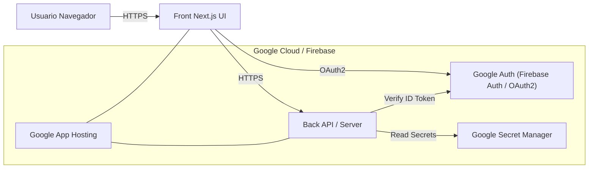

# Networking_Diagram

Diagrama de arquitectura a alto nivel con foco en el networking entre componentes.

```mermaid
flowchart LR
  user["Usuario Navegador"] -->|HTTPS| front["Front Next.js UI"]

  subgraph google_cloud["Google Cloud / Firebase"]
    apphost["Google App Hosting"]
    back["Back API / Server"]
    auth["Google Auth (Firebase Auth / OAuth2)"]
    secrets["Google Secret Manager"]
  end

  front -->|HTTPS| back
  front -->|OAuth2| auth
  back -->|Verify ID Token| auth
  back -->|Read Secrets| secrets

  apphost --- front
  apphost --- back
```
