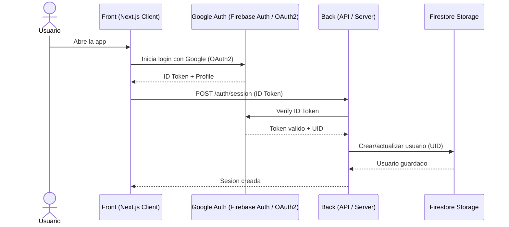
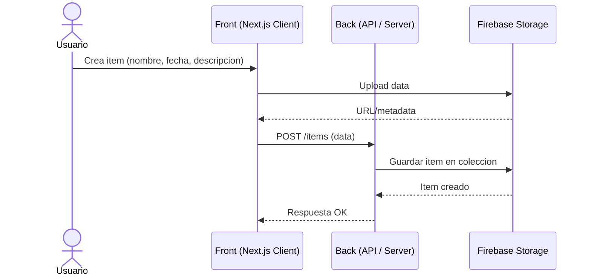

# SOFTWARE_DESIGN_DIAGRAM

Diagramas a nivel de componentes con el flujo de autenticacion y creacion de usuario/recursos.

```mermaid
sequenceDiagram
  actor U as Usuario
  participant UI as Front (Next.js Client)
  participant Auth as Google Auth (Firebase Auth / OAuth2)
  participant API as Back (API / Server)
  participant FS as Firestore Storage

  U->>UI: Abre la app
  UI->>Auth: Inicia login con Google (OAuth2)
  Auth-->>UI: ID Token + Profile
  UI->>API: POST /auth/session (ID Token)
  API->>Auth: Verify ID Token
  Auth-->>API: Token valido + UID
  API->>FS: Crear/actualizar usuario (UID)
  FS-->>API: Usuario guardado
  API-->>UI: Sesion creada
```

```mermaid
sequenceDiagram
  actor U as Usuario
  participant UI as Front (Next.js Client)
  participant API as Back (API / Server)
  participant ST as Firebase Storage

  U->>UI: Crea item (nombre, fecha, descripcion)
  UI->>ST: Upload data
  ST-->>UI: URL/metadata
  UI->>API: POST /items (data)
  API->>ST: Guardar item en coleccion
  ST-->>API: Item creado
  API-->>UI: Respuesta OK
```
